# Castle Game Server


## About

Experimental game server for any generic fantasy real-time strategy games

## Prerequisites

- GCC C++ Compiler 14.2.1 or above
- C++17 compliant compiler
- Meson build system (0.56.0 or newer)
- Ninja build system (1.12.1 or newer)

## Dependencies

- Boost 1.87.0 or newer
- SQLite 3.49.1 or newer

## Installation

On Debian/Ubuntu:

```sh
apt install meson ninja-build libboost-all-dev libsqlite3-dev
```

On Arch Linux:

```sh
pacman -S meson ninja boost sqlite
```

## Build & run

The build system used in this project is meson. First, setup a build directory:

```sh
mkdir build && cd build
meson setup ..
```

After generating the build files, build with ninja:

```sh
ninja
```

Finally run the executable:

```sh
./castle-game
```

## Implementation requirements

You need to implement your own:

- Items and inventory system
- Faction definitions and mechanics
- Unit types and behaviors
- Map layouts and generation
- Game mechanics and rules

## Project structure

```
castle-game/
├── src/                          # Source code directory
│   ├── main.cpp                  # Entry point of the server application
│   ├── server/                   # Core Server Logic
│   │   ├── castle_server.cpp     # CastleServer class implementation
│   │   ├── castle_server.h
│   │   ├── game_state.cpp        # GameState class implementation
│   │   ├── game_state.h
│   │   ├── player_manager.cpp    # PlayerManager class implementation
│   │   ├── player_manager.h
│   │   ├── map.cpp               # Map class implementation
│   │   ├── map.h
│   │   ├── resource_manager.cpp  # ResourceManager class implementation
│   │   ├── resource_manager.h
│   │   ├── chat_handler.cpp      # ChatHandler class implementation
│   │   ├── chat_handler.h
│   │   ├── timer.cpp             # Timer class implementation
│   │   ├── timer.h
│   │   └── client_connection.cpp # Boost.Asio individual client connections
│   │   └── client_connection.h
│   ├── units/                    # Unit-related classes
│   │   ├── unit.cpp              # Base Unit class implementation
│   │   ├── unit.h
│   │   ├── hero.cpp              # Hero class implementation
│   │   ├── hero.h
│   │   ├── building.cpp          # Building class implementation
│   │   ├── building.h
│   │   ├── unit_type.cpp         # UnitType class implementation
│   │   ├── unit_type.h
│   │   └── abilities/            # Ability definitions
│   │       ├── ability.cpp       # Base Ability class
│   │       └── ability.h
│   ├── factions/                 # Faction Definitions
│   │   ├── faction.cpp           # Faction class implementation
│   │   ├── faction.h
│   ├── items/                    # Item definitions
│   │   ├── item.cpp              # Base Item Class
│   │   └── item.h
│   ├── upgrades/                 # Upgrade Definitions
│   │   ├── upgrade.cpp           # Base Upgrade class
│   │   ├── upgrade.h
│   │   └── upgrade_manager.cpp   # UpgradeManager implementation
│   │   └── upgrade_manager.h
│   ├── shops/                    # Shop definitions
│   │   ├── shop.cpp              # Shop Class
│   │   ├── shop.h
│   ├── database/                 # Database interaction code (SQLite)
│   │   ├── database_manager.cpp  # Handles SQLite connections and queries
│   │   ├── database_manager.h
│   ├── networking/               # Boost.Asio related code
│   │   └── ... (Custom network protocol implementations, if any)
│   └── utils/                    # Utility functions and helper classes
│       ├── logging.cpp           # Simple logging implementation
│       ├── logging.h
│       └── config_parser.cpp     # Parses configuration and server settings
│       └── config_parser.h
├── include/                      # Header files
│   ├── server/
│   ├── units/
│   ├── factions/
│   ├── items/
│   ├── upgrades/
│   ├── shops/
│   ├── database/
│   ├── networking/
│   └── utils/
├── data/                         # Game Data (maps, unit definitions, etc.)
│   ├── maps/                     # Map files (e.g., custom map formats)
│   │   └── example_map.txt
│   ├── units/                    # Unit definition files
│   │   └── unit_definitions.proto
│   ├── factions/                 # Faction data files
│   │   └── faction_data.proto
├── build/                        # Meson Build System output directory (generated)
├── meson.build                   # Meson project file
├── README.md                     # Project documentation
└── .gitignore                    # Git ignore file

```

## Class diagram keys

```
+:      Public
-:      Private
~:      Protected
<>:     Association/Dependency
1..\*:  One or more
1:      Exactly one
0..1:   Zero or one (optional)
```

## Class diagram

```mermaid
classDiagram
    CastleServer "1" --> "1..*" PlayerManager
    CastleServer "1" --> "1" GameState
    CastleServer "1" --> "1" Map
    CastleServer "1" --> "1" ResourceManager
    CastleServer "1" --> "1" ChatHandler
    CastleServer "1" --> "1" Timer

    class CastleServer{
        -tcp::socket server_socket
        -GameState game_state
        -PlayerManager player_manager
        -Map map
        -ResourceManager resource_manager
        -ChatHandler chat_handler
        -Timer timer
        -bool cheat_enabled
        -float game_speed
        +start() void
        +stop() void
        +handle_client(tcp::socket) ClientConnection
        +get_game_state() GameState*
        +set_cheat_enabled(bool) void
        +set_game_speed(float) void
    }

    class GameState{
        -VictoryState victory_state
        -map~PlayerID, int~ player_scores
        -long long elapsed_time
        -bool is_game_over
        +get_victory_state() VictoryState
        +set_victory_state(VictoryState) void
        +update_player_score(PlayerID, int) void
        +get_player_score(PlayerID) int
        +is_game_over() bool
        +set_game_over(bool) void
    }

    class PlayerManager{
        -map~PlayerID, Player*~ players
        -PlayerID next_player_id
        -map~TeamNumber, vector~PlayerID~~ team_assignments
        +create_player(Faction, Color, float) Player*
        +remove_player(PlayerID) void
        +get_player(PlayerID) Player*
        +assign_to_team(PlayerID, TeamNumber) void
        +get_players_in_team(TeamNumber) vector~PlayerID~
    }

    class Player{
        -PlayerID player_id
        -Faction faction
        -Color color
        -float resource_handicap_percentage
        -int gold
        -int lumber
        -TeamNumber team_number
        -vector~Unit*~ units
        -vector~Building*~ buildings
        -Hero* hero
        -UpgradeManager upgrades
        +get_player_id() PlayerID
        +get_faction() Faction
        +get_color() Color
        +get_resource_handicap_percentage() float
        +add_gold(int) void
        +subtract_gold(int) void
        +add_lumber(int) void
        +subtract_lumber(int) void
        +assign_to_team(TeamNumber) void
        +get_team_number() TeamNumber
        +get_units() vector~Unit*~
        +get_buildings() vector~Building*~
        +set_hero(Hero*) void
        +get_hero() Hero*
    }

    Map "1" --> "*" Tile
    class Map{
        -vector~vector~Tile~~ map_data
        -FogOfWar fog_of_war
        -int tile_size
        +get_tile(int x, int y) Tile*
        +set_fog_of_war(FogOfWar) void
        +get_fog_of_war() FogOfWar
        +load_map(string) void
    }

    class ResourceManager{
        -float gold_generation_rate
        -float lumber_generation_rate
        -int upkeep_cost
        +calculate_resource_income(Player*) ResourceDelta
        +apply_upkeep(Player*) void
    }

    ChatHandler "1" --> "*" ChatMessage
    class ChatHandler{
        -vector~ChatMessage~ chat_log
        +send_message(PlayerID, string) void
        +receive_message(tcp::socket, string) void
        +get_chat_log() vector~ChatMessage~
    }

    class Timer{
        -long long elapsed_time
        -long long interval
        +start() void
        +stop() void
        +tick() bool
    }

    class Faction{
        -string name
        -Color color_preference
        -vector~UnitType~ starting_units
    }

    class Color{
        -int red
        -int green
        -int blue
    }

    UnitType "1" --> "*" Ability
    class UnitType{
        -string name
        -int cost_gold
        -int cost_lumber
        -int health
        -int attack
        -int armor
        -int speed
        -vector~Ability~ abilities
    }

    Unit "1" --> "1" Player
    Unit "1" --> "1" UnitType
    class Unit{
        -UnitType unit_type
        -Player* owner
        -int x
        -int y
        -int health
        -int max_health
        -int attack
        -int armor
        -int speed
        +move(int dx, int dy) void
        +attack(Unit*) void
        +take_damage(int damage) void
        +get_owner() Player*
    }

    Building "1" --> "1" Player
    Building "1" --> "1" BuildingType
    class Building{
        -BuildingType building_type
        -Player* owner
        -int x
        -int y
        -int health
        -int max_health
        +repair(int amount) void
        +take_damage(int damage) void
    }

    class BuildingType{
        -string name
        -int cost_gold
        -int cost_lumber
        -int health
        -float production_rate
    }

    Hero --|> Unit
    Hero "1" --> "*" Item
    class Hero{
        -int xp
        -int level
        -int intelligence
        -int agility
        -int strength
        -vector~Item*~ inventory
        -int hp
        -int mana
        +gain_xp(int amount) void
        +level_up() void
        +use_ability(Ability, Unit*) void
    }

    class Ability{
        -string name
        -float cooldown
        -int mana_cost
        -AbilityEffect effect
    }

    class Item{
        -string name
        -ItemType type
        -StatBonus stats_bonus
    }

    UpgradeManager "1" --> "*" Upgrade
    class UpgradeManager{
        -map~UpgradeID, Upgrade*~ upgrades
    }

    class Upgrade{
        -UpgradeID upgrade_id
        -string name
        -int cost_gold
        -int cost_lumber
        -UpgradeEffect effect
    }

    Shop "1" --> "*" Item
    class Shop{
        -int location_x
        -int location_y
        -map~Item*, int~ items
        -map~Item*, long long~ cooldowns
        +buy_item(Player*, Item*) bool
        +restock() void
    }
```



## Known problems

No error handling and logging are in place.

## Contributing

Changes are welcome. Breaking this project is highly encouraged!

## License

This is free and unencumbered software released into the public domain under The Unlicense.

Anyone is free to copy, modify, publish, use, compile, sell, or distribute this software, either in source code form or as a compiled binary, for any purpose, commercial or non-commercial, and by any means.

See [UNLICENSE](LICENSE) for full details.
